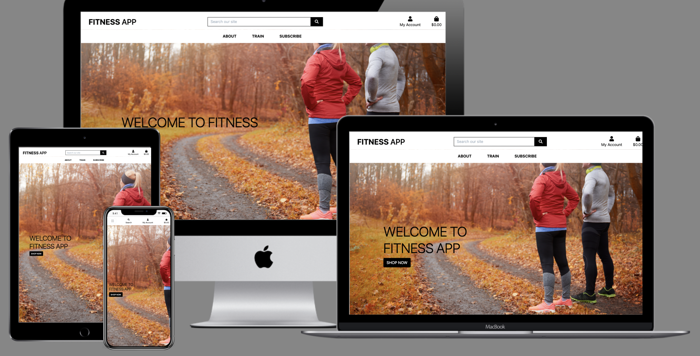
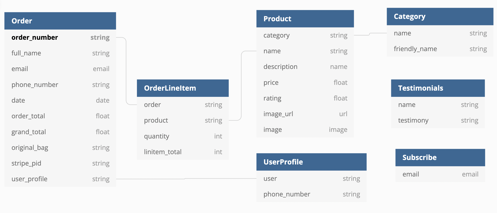
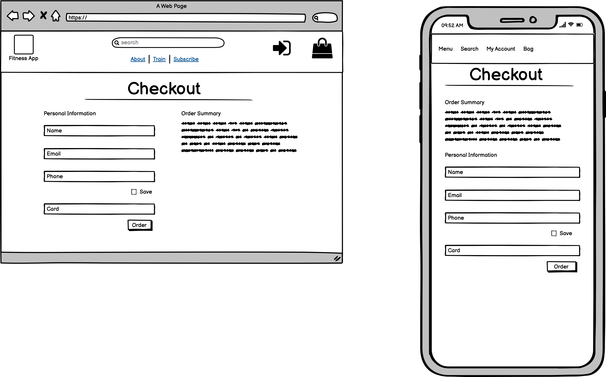
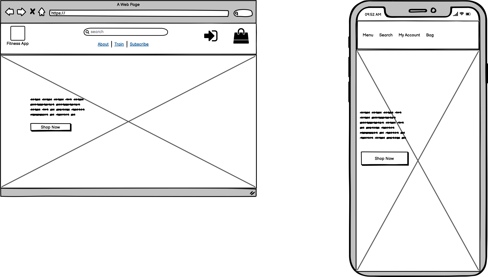
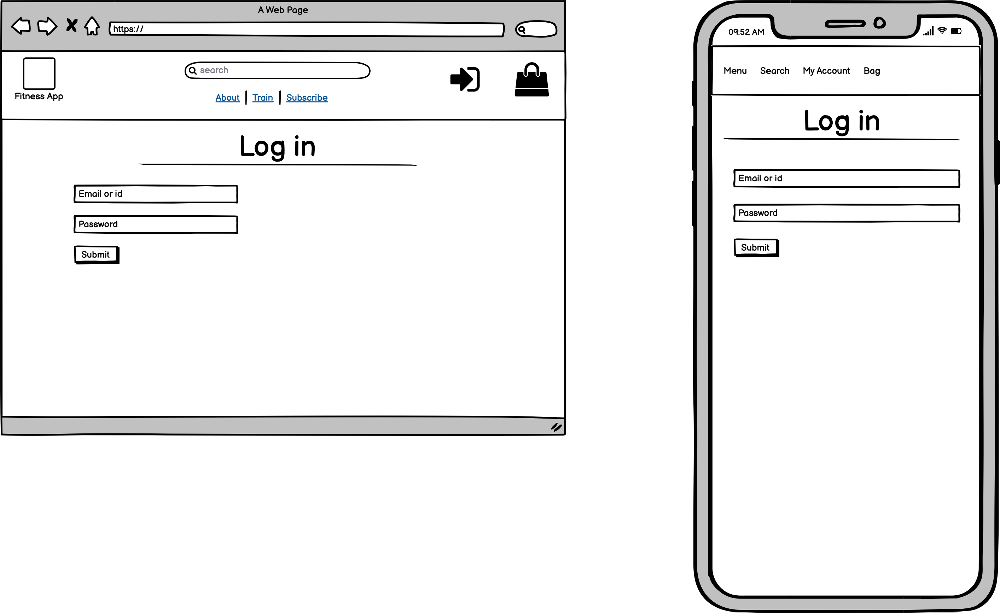
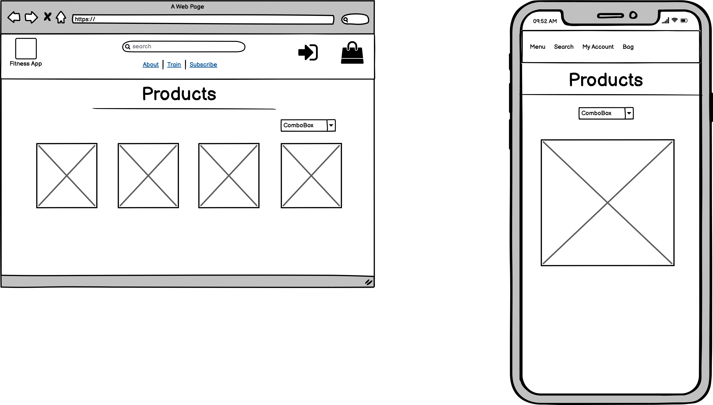
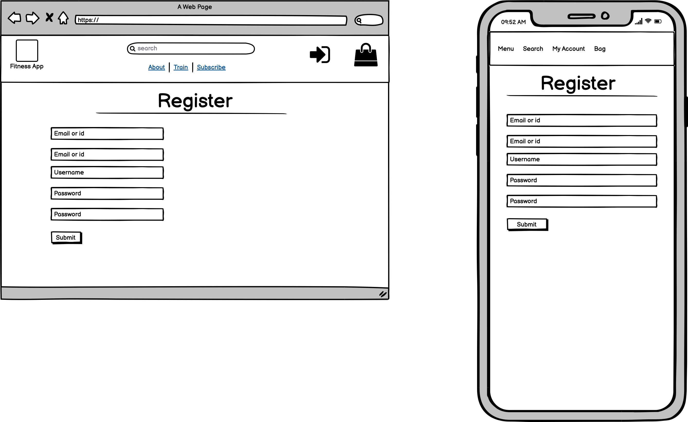

# Fitness App

[Github Repo](https://github.com/dhruv2102/MS4)

[Live Site](https://ms4-fitness-app.herokuapp.com/)

## About

The project is made to sell fitness classes and nutrition which can be use din any gym or at home. 

## Table of Contents
 1. [User Experience](#user-experience)
    - [User Stories](#user-stories)
    - [Database Architecture](#database-architecture)
    - [Wireframes](#wireframes)
2. [Features](#features)
3. [Technologies Used](#technologies-used)
4. [Testing](#testing)
5. [Deployment](#deployment)
6. [Credits](#credits)

## User Experience

### User Stories
- As a shopper
    1. View List of all products
    2. View individual product detail
    3. Easily view the total purchases
    4. Sort the list of available products
    5. Search for a product
    6. Easily see the number of search results
    7. Easily select the quantity of an item
    8. View items in the bag
    9. Adjust quantity of items in the bag
    10. Easily enter payment information
    11. View order confirmation and checkout

- As a site user
    1. Easily register for an account
    2. Log in or log out
    3. Easily recover password if forgotten
    4. Recieve an email confirmation after registering
    5. Have personalized user profile
    6. Subscribe to newsletter

- As a store owner
    1. Add a product
    2. Edit a product
    3. Delete a product

## Database Architecture

## Wireframes

#### About

#### Bag 

#### Checkout Page

#### Home Page

#### Login Page

#### Product Detail Page

#### All products

#### Profile Page

#### Register Page

#### Subscribe Page

## Features

- Header for easy access to other pages
- Search functionality
- Toast Messages
- Django allauth features
- Automatic eamils
- Responsiveness

## Technologies Used

#### Languages Used

- [HTML5](https://en.wikipedia.org/wiki/HTML5)
- [CSS3](https://en.wikipedia.org/wiki/Cascading_Style_Sheets)
- [JavaScript](https://en.wikipedia.org/wiki/Javascript)
- [Jquery](https://en.wikipedia.org/wiki/JQuery)
- [Python](https://en.wikipedia.org/wiki/Python_(programming_language))

#### Frameworks and Libraries

- [Bootstrap v4.5.0](https://getbootstrap.com/)
- [Font Awesome](https://fontawesome.com/)
- [Git](https://git-scm.com/)
- [GitPod](https://www.gitpod.io/)
- [Github](https://github.com/)
- [Heroku](https://www.heroku.com/)
- [Django](https://docs.djangoproject.com/en/3.2/)
- [Stripe](https://stripe.com/)
- [AWS](http://aws.amazon.com/)
- [Balsamiq](https://balsamiq.com/wireframes/desktop/)
- [Heroku Postgres](https://www.postgresql.org/)

## Testing
Testing could be found [here](testing.md)

## Deployment

<!-- https://raw.githubusercontent.com/RubySrivastava/ms4-fitnesswellness/master/README.md -->

#### AWS
1. Created a new Amazon account and connect to amazon service AWS3 account are cloud based serve where the project media and staicfiles will be stored unto. At first, we locate S3 on amazon service then we create a bucket. While creating the bucket on S3, the note that public access must be all switched off to allow access for users.

2. Once we've created the bucket, we now can now click on it's properties and enable the Static Website Hosting option, so it can serve the purpose of hosting our static files, you will need to input an index.html and error.html before saving. Then we go into the created bucket Permissions and click into CORS configuration, this part already have a prefilled default config, All that is needed is just to write the default code and save the config.

3. Then we go into the bucket policy to allows access to the contents across all web and inside this we will put in here some code including arn address displayed at the top of the heading. Then we go into amazon IAM to allow identity and access management of our stored files and folder. In the IAM service, we add a new group for our application and then we set the policies to ALL Then it generates a downlaodable zip file containing ID and KEY for us to use for the newly added group. This ID and KEY as to be stored in an environment variable.

4. This then allows us to into our terminal window and install some settings Boto3 Django Storages

5. The Django Storages is passed into the installed apps in settings and also a custom_storage file is created to store credentials in environment variable. And once everything looks fine we can run python3 manage.py collectstatic. This will collect all the static files in our app including any changes that is made. N.B this command has to be run in the development(local) environment each time a change is been made in the static files/folder And your folder and files should display in your AWS S3 BUCKETS

#### Heroku Deployment

1. Set up local workspace for Heroku
   - In terminal window of your IDE type: pip3 freeze -- local > requirements.txt. (The file is needed for Heroku toknow which filed to install.)
   - In termial window of your IDE type: python app.py > Procfile (The file is needed for Heroku to know which fileis needed as entry point.)
2. Set up Heroku: create a Heroku account and create a new app and select your region.
3. Deployment method 'Github'
   - Click on the Connect to GitHub section in the deploy tab in Heroku.
     - Search your repository to connect with it.
     - When your repository appears click on connect to connect your repository with the Heroku.
  - Add PostgreSQL Database
     - Click the resources tab.
     - Under Add-ons seach for Heroku Postgres and then click on it when it appears.
     - Select Plan name Hobby Dev - Free and then click Submit Order Form.
  - Goto CLI
     - pip3 install dj_database_url
     - pip3 install psycopg2-binary
     - pip3 freeze > requirements.txt
  - Go to settings.py
     - import OS
     - import dj_database_url
     - Add postgres url and comment sqlite
  - Migrate data
  - Dumpdata from sqlite and loaddata to postgresql
  - pip3 install gunicorn
  - pip3 freeze > requirements.txt
  - Create Procfile
  - Set DISABLE_COLLECTSTATIC=1
  - In settings.py set ALLOWED_HOSTS
  - Git add, commit and push.
  - Git push heroku master
  - Go to the settings app in Heroku and go to Config Vars. Click on Reveal Config Vars.Enter the variables.
     - AWS_ACCESS_KEY_ID
     - AWS_SECRET_ACCESS_KEY
     - DATABASE_URL
     - EMAIL_HOST_PASS
     - EMAIL_HOST_USER
     - SECRET_KEY
     - STRIPE_PUBLIC_KEY
     - STRIPE_SECRET_KEY
     - STRIPE_WH_SECRET
     - USE_AWS 
4. Automatic deployment: Go to the deploy tab in Heroku and scroll down to Aotmatic deployments. Click on EnableAutomatic Deploys. By Manual deploy click on Deploy Branch.

Heroku will receive the code from Github and host the app using the required packages. Click on Open app in the rightcorner of your Heroku account. The app wil open and the live link is available from the address bar.

#### Forking
If you wish to contribute to this website you can Fork it without affecting the main branch by following theprocedure outlined below.
1. Go to the GitHub website and log in.
2. Locate the [Repository](https://github.com/dhruv2102/MS4) used for this project.
3. On the right-hand side of the Repository name, you'll see the 'Fork' button. It's located next to the 'Star' and 'Watch' buttons.
4. This will create a copy in your personal repository.
5. Once you're finished making changes you can locate the 'New Pull Request' button just above the file listing inthe original repository.

#### Cloning 
If you wish to clone or download this repository to your local device you can follow the procedure outlined below.
1. Go to the GitHub website and log in.
2. Locate the [Repository](https://github.com/dhruv2102/MS4) used for this project.
3. Under the Repository name locate 'Clone or Download' button in green.
4. To clone the repository using HTTPS click the link under "Clone with HTTPS".
5. Open your Terminal and go to a directory where you want the cloned directory to be copied in.
6. Type `Git Clone` and paste the URL you copied from the GitHub.
7. To create your local clone press `Enter`

## Credits

Most of the code has been taken from Code Institute's Boutique Ado project walkthrough and adapted to requirements of this project

The images have been taken from freepik, Buitwithscience website

The content has been taken from Builtwithscienceß